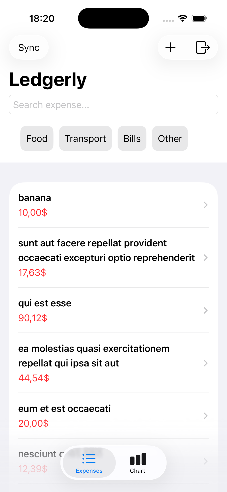
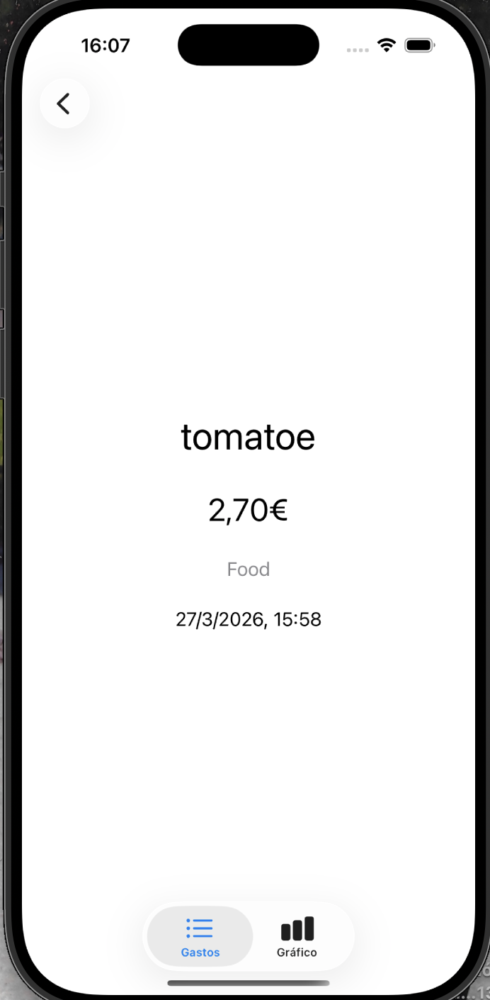
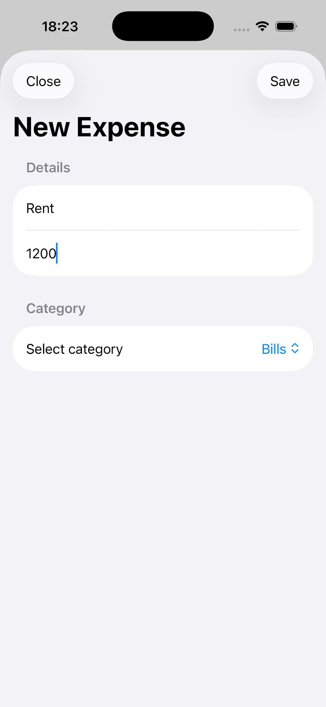
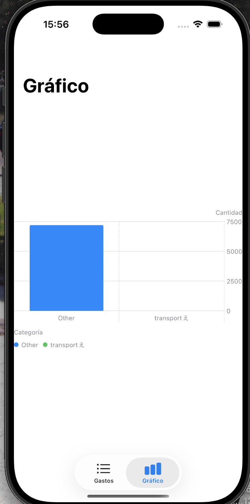
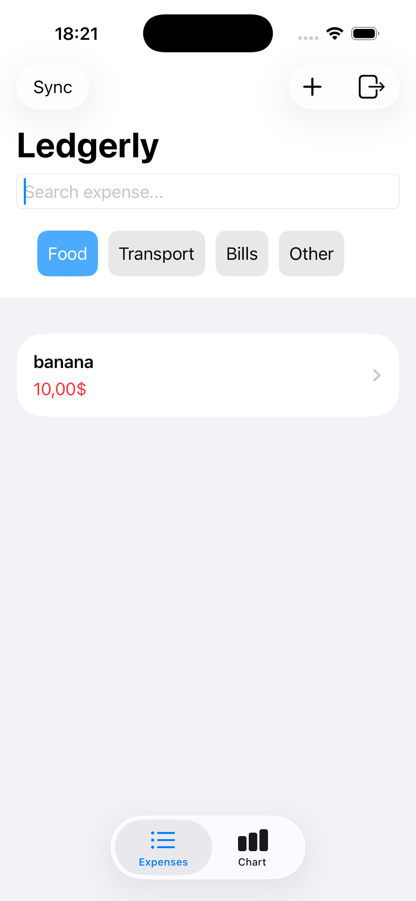
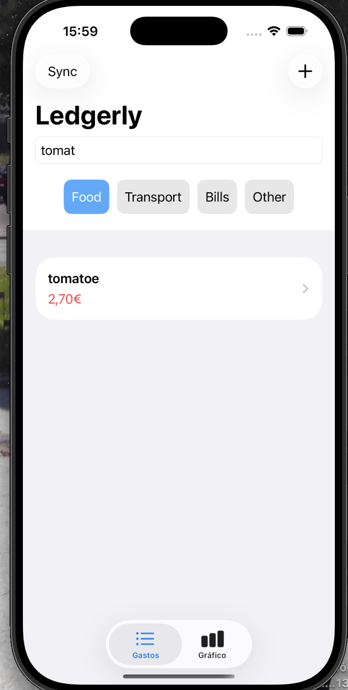

# Ledgerly — Personal Expense Tracker for iOS


A production-ready iOS expense tracker built with SwiftUI and MVVM architecture, featuring CoreData persistence, reactive filtering with Combine, Swift Charts visualization, local push notifications, and full English/French localization.

---

## Problem Statement

Individuals managing personal budgets need a fast, reliable way to record, categorize, and review daily expenses — without depending on a cloud subscription or giving up their data to a third-party service.

Ledgerly solves this by providing a clean, offline-first iOS app that:
- Stores all data locally with CoreData, with optional backend sync
- Filters and searches expenses reactively using Combine publishers
- Visualizes spending by category with Swift Charts
- Reminds users to log expenses daily via local notifications
- Supports English and French out of the box

---

## Screenshots

### Main
The first page you see when you open the app is Ledgerly page. Here you can see all the expenses with the title and the amount.



### Detail
If you click on an expense, you'll see all the information of an expense: the name, amount, category and date.



### Add Expense
When you click on the + button you can create an expense, saying the title, amount and category.



### Chart
In the second tab you can see a chart with all the categories.



### Filter
You can filter the expenses if you click on the expenses menu.



### Search
You can search an expense by name.



---

## Features

### Expense Management
- Add expenses with title, amount, date, and category
- Swipe to delete with immediate CoreData persistence
- Navigate to a detail view for each expense
- Categories: Food, Transport, Bills, Other

### Reactive Search & Filtering
- Live search by title using a Combine `CombineLatest` publisher
- Filter by category using a horizontal `LazyHGrid` chip selector
- Both filters compose — category + search work simultaneously
- All filtering happens in the ViewModel, never in the View

### Backend Sync
- Sync button fetches remote expenses via `URLSession` async/await
- Network layer fully encapsulated in `NetworkService` — zero network code in views
- Deduplication logic prevents repeated sync from creating duplicates
- Uses a public REST API (`jsonplaceholder.typicode.com`) as a mock backend

### Charts
- Bar chart per category using Swift Charts (native, no third-party dependency)
- Color-coded by category for immediate visual breakdown

### Local Notifications
- Requests permission on first launch
- Schedules a daily reminder at 20:00 using `UNCalendarNotificationTrigger`
- Notifications appear even while the app is in the foreground via `UNUserNotificationCenterDelegate`

### Localization
- Full English and French support via `Localizable.xcstrings` (String Catalog)
- All UI strings, labels, and notification content are translated
- Switch language from iOS Settings — no app restart needed

---

## Tech Stack

| Layer | Technology | Reason |
|-------|-----------|--------|
| UI Framework | SwiftUI | Declarative, adaptive layouts across all iOS/iPadOS sizes |
| Architecture | MVVM | Clear separation between view, logic, and data |
| Persistence | CoreData | Native iOS ORM with full lifecycle management |
| Reactivity | Combine | `CombineLatest` for composable, reactive filtering |
| Networking | URLSession (async/await) | Native, no external dependency needed |
| Charts | Swift Charts | Native framework, zero overhead, full SwiftUI integration |
| Animations | Lottie (SPM) | JSON-based animations for save confirmation feedback |
| Notifications | UserNotifications | Local push notifications with foreground display support |
| Localization | String Catalog (.xcstrings) | Single-file i18n with Xcode visual editor |
| Dependency Mgmt | Swift Package Manager | Native, no Podfile needed |

---

## Architecture

Ledgerly follows a strict MVVM architecture with a clean separation between layers:

```
Ledgerly/
├── data/
│   ├── network/
│   │   └── NetworkService.swift          # URLSession calls — no network code outside this file
│   ├── persistence/
│   │   └── CoreDataStack.swift           # NSPersistentContainer singleton
│   └── repositories/
│       └── ExpenseRepository.swift       # CoreData + network coordination
├── domain/
│   ├── models/
│   │   └── Expense.swift                 # Pure Swift struct — Identifiable, Codable
│   └── repositories/
│       └── ExpenseRepositoryProtocol.swift
├── presentation/
│   ├── viewmodels/
│   │   └── ExpenseListViewModel.swift    # @MainActor ObservableObject with Combine
│   └── views/
│       ├── LedgerlyTabView.swift         # Root tab navigation
│       ├── AddExpenseView.swift          # Sheet with Lottie confirmation
│       ├── ExpenseDetailView.swift       # Read-only detail
│       ├── ExpensesChartView.swift       # Swift Charts bar chart
│       ├── CategoriesGridView.swift      # LazyHGrid category chips
│       └── LottieView.swift             # UIViewRepresentable wrapper
└── services/
    └── NotificationService.swift         # UNUserNotificationCenter singleton
```

### Key Design Decisions

**Protocols everywhere** — `NetworkServiceProtocol` and `ExpenseRepositoryProtocol` decouple every layer. The ViewModel only knows the protocol, never the concrete class. This makes testing straightforward and dependencies swappable.

**`@MainActor` consistency** — `ExpenseListViewModel`, `ExpenseRepository`, and `NetworkService` are all annotated `@MainActor`, eliminating actor-isolation warnings and ensuring CoreData's `viewContext` is always accessed on the main thread.

**Combine for filtering** — rather than recomputing filtered results on every view render, a `CombineLatest` publisher observes `searchText` and `selectedCategory` simultaneously and updates `filteredExpenses` only when either changes. This is more efficient and demonstrates reactive programming patterns.

**`insertExpense` vs `addExpense`** — the repository exposes a public `addExpense` (insert + save) and a private `insertExpense` (insert only). `syncWithBackend` uses the private method to batch-insert all remote expenses and calls `context.save()` exactly once at the end, avoiding N redundant saves in a loop.

---

## Running the Project

### Requirements
- Xcode 15 or later
- iOS 16+ simulator or physical device
- Swift 5.9+

### Setup

```bash
# Clone the repository
git clone https://github.com/AdrianMalmierca/ledgerly.git
cd ledgerly

# Open in Xcode
open Ledgerly.xcodeproj
```

Swift Package Manager will resolve dependencies (Lottie) automatically on first open.

Select a simulator or device and press **Run** (⌘R).

### Dependencies (via Swift Package Manager)

| Package | Version | Purpose |
|---------|---------|---------|
| [Lottie](https://github.com/airbnb/lottie-ios) | 4.x | JSON animation for save confirmation |

---

## Localization

The app is fully localized in English and French using Xcode's String Catalog format (`.xcstrings`).

To test French localization in the simulator:
1. Product → Scheme → Edit Scheme
2. Options tab → App Language → French
3. Run the app

All UI labels, tab names, navigation titles, form fields, and notification content are translated.

---

## API & Sync

The sync feature uses [JSONPlaceholder](https://jsonplaceholder.typicode.com) as a mock REST backend. On sync, the app fetches the first 20 posts and maps them to `Expense` objects with randomized amounts — demonstrating the full network → repository → CoreData pipeline without requiring a real backend.

The network layer is fully encapsulated:
- `NetworkServiceProtocol` defines the interface
- `NetworkService` implements it using `URLSession` with `async/await`
- `ExpenseRepository` calls the network service and handles persistence
- `ExpenseListViewModel` calls the repository — no URLSession code anywhere near a View

---

## What I Learned Building This

### MVVM in SwiftUI
SwiftUI's `@StateObject` and `@ObservedObject` make it easy to connect ViewModels to views, but the real discipline is keeping logic out of the view entirely. Every filter, every mutation, every async operation lives in the ViewModel or below — views only read and dispatch.

### Combine for Reactive State
Using `CombineLatest` to compose two independent filter streams into a single derived list was a clear win over managing it imperatively. The publisher graph makes the data flow explicit and the code shorter.

### CoreData + Swift Concurrency
Mixing CoreData's `viewContext` with Swift's `async/await` and actor isolation required care. Marking the entire repository `@MainActor` was the cleanest solution — it guarantees the context is always accessed on the right thread without per-method annotations.

### `UNUserNotificationCenterDelegate`
iOS silently drops local notifications when the app is in the foreground unless the delegate's `willPresent` method explicitly opts in. Implementing `AppDelegate` with `UNUserNotificationCenterDelegate` and returning `[.banner, .sound, .badge]` was a non-obvious but necessary step.

### String Catalog vs Legacy `.strings`
The new `.xcstrings` format introduced in Xcode 15 consolidates all languages into a single file with a visual editor. It's strictly better than the legacy approach — no more syncing separate files per language.

---

## Future Improvements

### Short Term
- Replace JSONPlaceholder with a real backend (FastAPI or Express) with proper expense endpoints
- Add expense editing — currently expenses are read-only after creation
- Add a monthly budget limit with a progress indicator

### Medium Term
- iCloud sync via CloudKit for multi-device support
- Export to CSV for spreadsheet analysis
- Widget for home screen showing today's total spending

### Long Term
- Recurring expenses with automatic creation
- Receipt photo attachment stored in the file system
- Spending trends and month-over-month comparison

---

## License

MIT — free to use, modify, and deploy.

---

## Author

**Adrián Martín Malmierca**  
Computer Engineer & Mobile Applications Master's Student  
[GitHub](https://github.com/AdrianMalmierca) · [LinkedIn](https://www.linkedin.com/in/adri%C3%A1n-mart%C3%ADn-malmierca-4aa6b0293/)